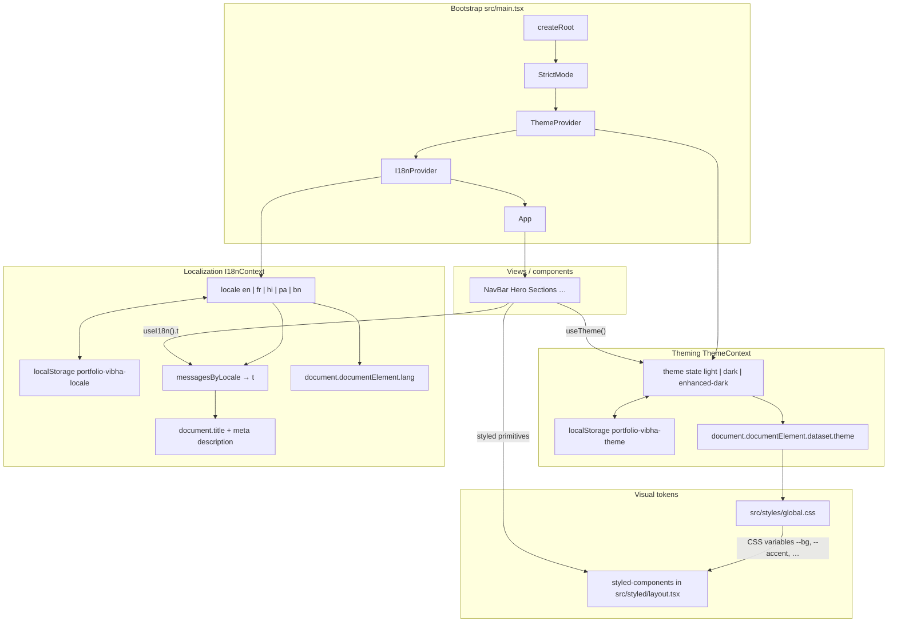

# my-portfolio-vibha

Personal portfolio site built with React and Vite.

## Tech stack

| Layer | Technology |
|--------|------------|
| **UI library** | [React 18](https://react.dev/) |
| **Language** | [TypeScript](https://www.typescriptlang.org/) (~5.6) |
| **Build & dev server** | [Vite 5](https://vitejs.dev/) with [@vitejs/plugin-react](https://github.com/vitejs/vite-plugin-react) |
| **Styling** | [styled-components v6](https://styled-components.com/) (CSS-in-JS, theme tokens via CSS custom properties on `document.documentElement`) |
| **Global design tokens** | Plain CSS variables in `src/styles/global.css` (light, dark, enhanced-dark themes) |
| **E2E & coverage** | [Cypress 13](https://www.cypress.io/), [@cypress/code-coverage](https://github.com/cypress-io/code-coverage), [vite-plugin-istanbul](https://github.com/iFaxity/vite-plugin-istanbul), [nyc](https://github.com/istanbuljs/nyc), [start-server-and-test](https://github.com/bahmutov/start-server-and-test) |
| **i18n** | Custom React context + locale modules (`src/i18n/`) — English, French, Hindi, Punjabi (Gurmukhi), Bengali |
| **Fonts** | [Google Fonts](https://fonts.google.com/) — Outfit, Fraunces, Noto Sans (Devanagari, Gurmukhi, Bengali) |

## Scripts

| Command | Description |
|---------|-------------|
| `npm start` | Dev server at **http://localhost:4000** |
| `npm run build` | Typecheck (`tsc -b`) and production bundle |
| `npm run preview` | Preview production build on port 4000 |
| `npm run cy:open` | Open Cypress interactively |
| `npm test` | Instrumented dev server + headless Cypress run |

## Requirements

- **Node.js** (LTS recommended) and npm

## Quick start

```bash
npm install
npm start
```

Open [http://localhost:4000](http://localhost:4000).

## Project layout (high level)

- `src/App.tsx` — app shell and document title/description from i18n
- `src/components/` — `NavBar`, `Hero`, section blocks
- `src/styled/layout.tsx` — styled-components layout primitives
- `src/i18n/` — locale strings and `I18nProvider`
- `src/theme/` — theme name + `data-theme` on `<html>`
- `public/images/` — static assets (e.g. portrait)

## Architecture: theming, localization, and views

Bootstrap order and how **theme** and **locale** reach the UI and the document.



**How to read it:** `ThemeProvider` sits **outside** `I18nProvider` so both contexts are available everywhere under `App`. Theme writes `data-theme` on `<html>`; global CSS defines variables per `[data-theme=…]`; styled layout reads those variables. Locale picks a message tree `t`, updates `lang`, and drives copy (including `document` meta from `App`).

## License

Private / unlicensed unless you add a license file.
